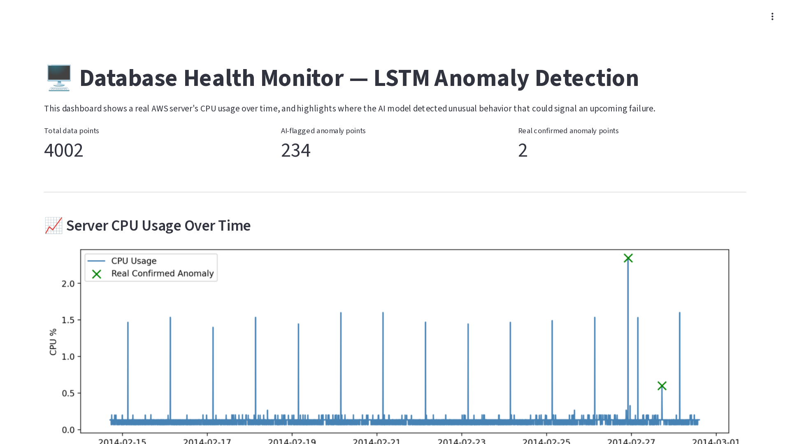
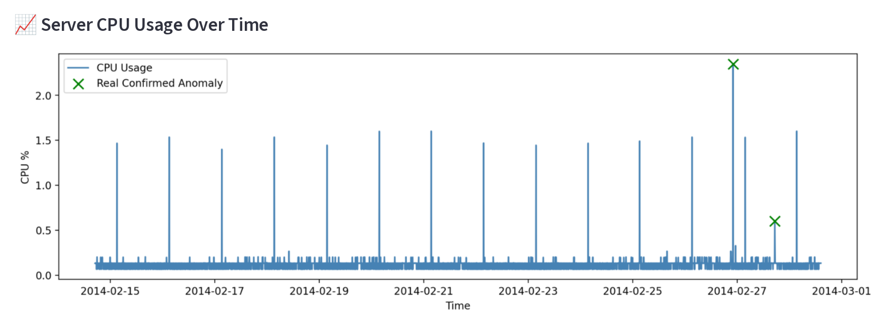
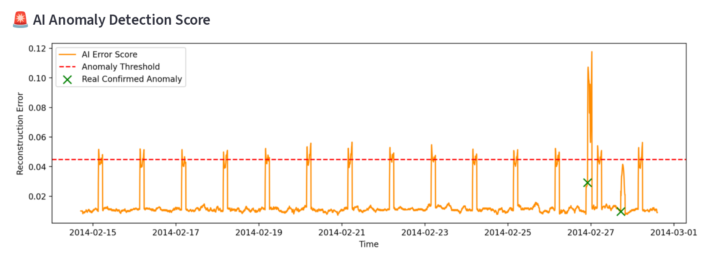
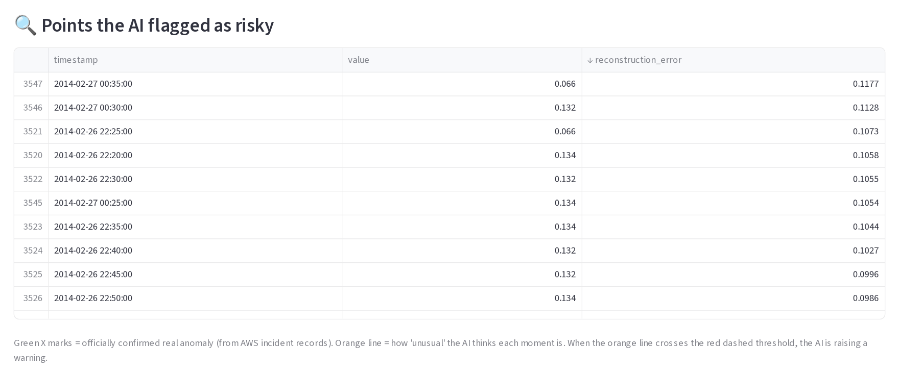

# 🖥️ LSTM Database Anomaly Detection (Real AWS Data)

### "Predicting database failures before they happen"

An unsupervised LSTM autoencoder trained on real AWS CloudWatch CPU metrics, with results explored through an interactive Streamlit dashboard.

<p align="center">
  
  
  
  
  
</p>

<p align="center">
  <b>Real AWS CPU data → Scaling → Sliding windows → LSTM Autoencoder → Reconstruction error → Threshold → Dashboard</b>
</p>

<p align="center">
  <a href="https://github.com/N230881/DB_Anomaly_Detection">GitHub Repository</a>
</p>

---

## 🚀 Live Demo

<p align="center">
<a href="https://dbanomalydetection-ccdxqxnjuvoonzrx4yenrq.streamlit.app/">
  
</a>
</p>

> **Explore the results in your browser.**
>
> The dashboard shows the server's CPU usage, the AI's anomaly score against its detection threshold, the officially confirmed incident, and a searchable, sortable, exportable table of every point the model flagged.

🔗 **[Launch the Dashboard →](https://dbanomalydetection-ccdxqxnjuvoonzrx4yenrq.streamlit.app/)**

> ℹ️ The hosted dashboard shows **precomputed results** from `train_model.py` (`outputs/results.csv`). The model is trained offline. The web app doesn't retrain it or run live inference.

---

## 🎬 Demo Video
A walkthrough of the dashboard: key metrics, CPU and anomaly-score charts, flagged-point exploration (scroll, sort, search) and CSV export.


https://github.com/user-attachments/assets/f513f1e3-6d21-4114-a545-9056488ee2b9


---

## 📸 Dashboard

### 🖥️ Overview: Key Metrics



### 📈 Server CPU Usage Over Time

Green ✕ marks are the officially labelled anomaly timestamps from the Numenta Anomaly Benchmark.



### 🚨 AI Anomaly Detection Score

The orange line shows the model's reconstruction error, which is how unusual each moment looks. The red dashed line is the detection threshold.



### 🔍 Points the AI Flagged as Risky

Shown sorted by `reconstruction_error`, highest first.



---

## 🌐 Try It Online

| Resource | Link |
| --- | --- |
| 🚀 **Live Dashboard** | [Open Streamlit App](https://dbanomalydetection-ccdxqxnjuvoonzrx4yenrq.streamlit.app/) |
| 💻 **Source Code** | [GitHub Repository](https://github.com/N230881/DB_Anomaly_Detection) |
| 📊 **Dataset** | [Numenta Anomaly Benchmark (NAB)](https://github.com/numenta/NAB) |

---

## 💡 What this project does (in one line)

It watches a server's health (CPU usage) the way a hospital monitor watches a heartbeat. It warns you when the pattern starts looking abnormal, ideally hours before an actual crash.

## 🛒 Real-life example

Imagine an online shopping website whose database server usually runs at 30% CPU. One night, CPU slowly creeps up and stays high for hours, which is a warning sign. Two hours later the server crashes and the whole website goes down.

This project uses a **real, historically confirmed AWS server incident** from Amazon CloudWatch metrics published in the Numenta Anomaly Benchmark. It trains an AI to recognize that kind of early-warning pattern automatically.

## 🆓 No paid AI API needed

Everything here uses free, open-source tools:

* **TensorFlow/Keras** builds and trains the AI model. It's 100% free and runs on your own computer.
* **The NAB dataset** provides real, publicly available AWS server data, free from [github.com/numenta/NAB](https://github.com/numenta/NAB).
* **Streamlit** powers the dashboard, also free.

---

## 🚀 How it works

It uses a **real, historically confirmed AWS incident** from the [Numenta Anomaly Benchmark](https://github.com/numenta/NAB) (`realAWSCloudwatch/ec2_cpu_utilization_24ae8d.csv`). An **LSTM autoencoder** learns what *normal* server behaviour looks like **without ever being shown the anomaly**. Moments the model cannot reconstruct well get flagged as risky.

```text
                   ┌──────────────────────────┐
                   │   AWS CloudWatch CPU     │
                   │  (NAB, 5-min readings)   │
                   └────────────┬─────────────┘
                                │
                                ▼
                   ┌──────────────────────────┐
                   │      MinMaxScaler        │
                   │     values → [0, 1]      │
                   └────────────┬─────────────┘
                                │
                                ▼
                   ┌──────────────────────────┐
                   │     Sliding Windows      │
                   │ 30 readings (2.5 hours)  │
                   └────────────┬─────────────┘
                                │
                                ▼
                   ┌──────────────────────────┐
                   │    LSTM Autoencoder      │
                   │ trained on normal data   │
                   └────────────┬─────────────┘
                                │
                                ▼
                   ┌──────────────────────────┐
                   │  Reconstruction Error    │
                   │  mean |pred − x| per win │
                   └────────────┬─────────────┘
                                │
                                ▼
                   ┌──────────────────────────┐
                   │       Threshold          │
                   │ 95th pct of train error  │
                   └────────────┬─────────────┘
                                │
                                ▼
                   ┌──────────────────────────┐
                   │  results.csv + plot  →   │
                   │   Streamlit Dashboard    │
                   └──────────────────────────┘
```

---

## ✨ Features

<table>
<tr>
<td>

### 📊 Real Data

* Real AWS CloudWatch EC2 CPU metrics
* Official NAB anomaly labels
* Auto-download on first run
* 4,032 readings at 5-minute intervals

</td>
<td>

### 🧠 Model

* LSTM autoencoder (encoder → decoder)
* Unsupervised: trained on normal data only
* 30-step sliding windows
* Saved as `model/lstm_anomaly_model.h5`

</td>
</tr>
<tr>
<td>

### 🚨 Detection

* Per-window reconstruction error
* Data-driven threshold (95th percentile)
* Binary anomaly flag per timestamp
* Results written to `outputs/results.csv`

</td>
<td>

### 🌐 Dashboard

* Key metrics at a glance
* CPU usage + anomaly-score charts
* Confirmed incident markers
* Sortable/searchable table with CSV export

</td>
</tr>
</table>

---

# 🧩 Project Architecture

The project keeps **training** separate from **visualization**.

| Component | Responsibility |
| --- | --- |
| `train_model.py` | Downloads data and labels, scales, builds windows, trains the LSTM autoencoder, scores every window, and saves the model, results and plot |
| `app.py` | Streamlit dashboard that reads `outputs/results.csv` and renders metrics, charts and the flagged-points table |
| `data/realAWSCloudwatch/` | Raw NAB CPU time series |
| `labels/combined_labels.json` | Official NAB anomaly labels |
| `model/lstm_anomaly_model.h5` | Trained Keras model |
| `outputs/results.csv` | Per-timestamp score, threshold and prediction |
| `outputs/anomaly_plot.png` | Static plot of score vs threshold vs confirmed anomaly |
| `.devcontainer/` | One-click GitHub Codespaces / Dev Container setup |

---

# 🔬 Pipeline

## 01: Data Acquisition

If the files are missing, `train_model.py` downloads them from the NAB repository:

* `ec2_cpu_utilization_24ae8d.csv` contains **4,032** CPU readings from **2014-02-14 14:30** to **2014-02-28 14:25**, one every 5 minutes.
* `combined_labels.json` contains the official anomaly timestamps for that file:

```text
2014-02-26 22:05:00
2014-02-27 17:15:00
```

Each reading gets an `is_real_anomaly` flag when its timestamp matches a label.

---

## 02: Preprocessing

CPU values are scaled to `[0, 1]` with `MinMaxScaler`. They are then cut into overlapping **sliding windows of 30 readings** (2.5 hours):

```text
4,032 readings  →  4,002 windows of shape (30, 1)
```

---

## 03: Train / Test Split

To keep the model honest, it trains **only on data before the incident**:

```python
anomaly_start_index = first labelled anomaly          # 2014-02-26 22:05
train_cutoff = max(anomaly_start_index - 30 - 50, 50)  # stays clear of the incident

X_train = X[:train_cutoff]   # 3,467 "normal" windows
X_test  = X                  # all 4,002 windows (includes the incident)
```

---

## 04: LSTM Autoencoder

```text
Input (30 × 1)
   │
   ▼
LSTM(32, relu)            ← encoder: compress the 2.5-hour window
   │
   ▼
RepeatVector(30)
   │
   ▼
LSTM(32, relu, return_sequences=True)   ← decoder
   │
   ▼
TimeDistributed(Dense(1)) ← reconstructed window (30 × 1)
```

| Setting | Value |
| --- | --- |
| Loss | Mean Squared Error |
| Optimizer | Adam |
| Epochs | 25 |
| Batch size | 32 |
| Validation split | 10% |

The model learns to reproduce **normal** windows. When it sees behaviour it never learned, the reconstruction gets worse.

---

## 05: Anomaly Scoring and Thresholding

For every window:

```python
reconstruction_error = mean(|X_pred - X_test|)            # per window
threshold = percentile(reconstruction_error[:train_cutoff], 95)
predicted_anomaly = reconstruction_error > threshold
```

The threshold comes from the data rather than being hand-picked. In the committed results it is **0.0448**.

---

## 06: Outputs

`outputs/results.csv` has one row per scored timestamp:

| Column | Meaning |
| --- | --- |
| `timestamp` | Reading time |
| `value` | Raw CPU utilization |
| `is_real_anomaly` | Official NAB label |
| `scaled_value` | Min-max scaled value |
| `reconstruction_error` | Model's anomaly score |
| `threshold` | Detection threshold |
| `predicted_anomaly` | `True` if score > threshold |

`outputs/anomaly_plot.png` is a static summary plot:


---

# 📊 Results

From the committed `outputs/results.csv`:

| Metric | Value |
| --- | --- |
| Scored data points | **4,002** |
| Points flagged by the model | **234** |
| Official NAB anomaly labels | **2** (2014-02-26 22:05 and 2014-02-27 17:15) |
| Detection threshold | **0.0448** |
| Highest anomaly score | **0.1177** at 2014-02-27 00:35 |

### How to read the results (important, honest explanation)

The AI doesn't perfectly draw a box around only the real anomaly. That's normal and expected for this kind of unsupervised model. Here is what to look for:

* **The score rises during the incident.** The AI's error score rises noticeably **during** the real confirmed anomaly window (2014-02-26 22:05 to 2014-02-27 17:15).
* **The strongest signals sit in the incident period.** The **20 highest** reconstruction errors in the whole dataset, including the maximum, all fall between the two labelled timestamps (2014-02-26 22:05 → 2014-02-27 17:15).
* **46 of the 234 flagged points** fall in that period.
* **The other flags come from recurring spikes.** The CPU series has a regular, roughly daily spike pattern. Many of those spikes briefly cross the threshold, so the model also flags them.
* **The labelled timestamps themselves stay below the threshold.** Neither of the two exact timestamps is flagged; the scores rise during the hours between them.
* **The model was never shown the incident.** It still picks up genuinely unusual server behaviour, even though it was never told where the anomaly was during training.

This is how real-world anomaly detection works. The model says *"this looks unusual, someone should check it,"* not *"I am 100% certain this is a failure."* That's why these systems are used to **prioritise what engineers investigate**, not to fully replace human judgement.

> These numbers describe the saved run. Retraining can change them slightly because neural-network training is not seeded.

---

# 📁 Folder Structure

```text
DB_Anomaly_Detection/
│
├── .devcontainer/
│   └── devcontainer.json                    ← one-click GitHub Codespaces setup
│
├── data/
│   └── realAWSCloudwatch/
│       └── ec2_cpu_utilization_24ae8d.csv   ← real AWS data (auto-downloads on first run)
│
├── labels/
│   └── combined_labels.json                 ← official real anomaly timestamps (auto-downloads)
│
├── model/
│   └── lstm_anomaly_model.h5                ← saved trained model (created after training)
│
├── outputs/
│   ├── results.csv                          ← final anomaly predictions (created after training)
│   └── anomaly_plot.png                     ← saved graph (created after training)
│
├── docs/                                    ← dashboard screenshots used in this README
│   ├── 01-dashboard.png
│   ├── 02-cpu-usage.png
│   ├── 03-anomaly-score.png
│   ├── 04-flagged-points.png
│   └── 05-training-anomaly-plot.png
│
├── train_model.py                           ← run this FIRST: trains the AI
├── app.py                                   ← run this SECOND: shows the dashboard
├── requirements.txt                         ← list of free Python libraries needed
├── .gitignore
└── README.md                                ← this file
```

---

# ⚙️ How to Run This Project (Step by Step)

### Step 1: Install Python

If you don't already have Python, download it free from **[python.org/downloads](https://www.python.org/downloads/)**. Get version **3.10 or higher**, and during install make sure to check **"Add Python to PATH"**.

### Step 2: Get the code and open a terminal in the project folder

```bash
git clone https://github.com/N230881/DB_Anomaly_Detection.git
cd DB_Anomaly_Detection
```

* **Windows:** open the folder, type `cmd` in the address bar and press Enter.
* **Mac/Linux:** right-click the folder and choose "Open Terminal Here", or use `cd` to navigate to it.

*Optional (recommended):* create a virtual environment first:

```bash
python -m venv .venv
source .venv/bin/activate        # Windows: .venv\Scripts\activate
```

### Step 3: Install the required free libraries

```bash
pip install -r requirements.txt
```

This installs these pinned, free and open-source libraries:

```text
tensorflow-cpu==2.20.0
pandas==2.3.3
numpy==2.1.3
scikit-learn==1.7.2
matplotlib==3.10.7
streamlit==1.50.0
```

### Step 4: Train the AI model

Results are already committed, so this step is optional.

```bash
python train_model.py
```

What happens:

1. It automatically downloads the real AWS server data and the official anomaly labels, so there's nothing to download by hand.
2. It trains an LSTM autoencoder for about 1–3 minutes on a normal laptop.
3. It saves the trained model to `model/lstm_anomaly_model.h5`.
4. It saves the results to `outputs/results.csv` and a graph to `outputs/anomaly_plot.png`.

You'll see training progress in the terminal, ending with:

```text
DONE. Now run:  streamlit run app.py
```

### Step 5: Launch the dashboard

```bash
streamlit run app.py
```

This opens a browser window, usually at `http://localhost:8501`, showing:

* the raw CPU usage graph with the real confirmed anomaly marked in green
* the AI's "how unusual is this moment" score, with a red threshold line
* a table of every point the AI flagged as risky, which you can sort, search and export as CSV

## ☁️ GitHub Codespaces

The repo includes a Dev Container. Open it in Codespaces and the dependencies install automatically. The dashboard starts on port **8501**.

---

# 🌍 Deploying the Dashboard Online (optional, free)

1. Push this whole folder to a GitHub repository.
2. Go to **[share.streamlit.io](https://share.streamlit.io)** and sign in with GitHub.
3. Select your repository and set `app.py` as the entry point.
4. Click **Deploy** to get a free public link to share with recruiters.

> **Note:** Streamlit Cloud starts with a fresh environment, so `train_model.py` must already have generated `outputs/results.csv` before you deploy. Commit that file to your repo, or add a step in `app.py` that runs training automatically on first load. This repo already commits `outputs/results.csv`.

---

# 🎤 How to Explain This Project in an Interview (plain language)

> "I built an anomaly detection system using a real AWS server dataset with a documented, confirmed incident. I trained an LSTM autoencoder, a neural network that learns to reconstruct normal patterns, using only the 'healthy' portion of the data before the incident. When I tested it against the full timeline, the model's reconstruction error rose sharply during the confirmed incident period. The 20 highest anomaly scores in the whole dataset all fall inside that window. That shows it can flag genuinely abnormal server behaviour using only historical performance metrics, without ever being told where the anomaly was."

---

# 📊 Engineering Highlights

```text
✓ Real-world, labelled AWS CloudWatch data (NAB)
✓ Automatic dataset + label download
✓ Time-series scaling and sliding-window sequencing
✓ Leakage-aware train/test split (train only on pre-incident data)
✓ LSTM encoder–decoder (autoencoder) in TensorFlow/Keras
✓ Unsupervised anomaly scoring via reconstruction error
✓ Data-driven percentile threshold
✓ Reproducible artifacts (model, CSV, plot)
✓ Interactive Streamlit dashboard
✓ Sort, search and CSV export of flagged points
✓ One-click Codespaces setup
```

---

# ⚠️ Scope

This is an **educational / portfolio project**, not a production monitoring system.

It currently:

* uses a **single metric** (CPU utilization) from **one** server
* trains **offline**, while the dashboard shows **saved results**
* flags some recurring, non-incident spikes, so precision is limited
* reports results visually and doesn't yet compute a formal NAB score or precision/recall

---

# 🛣️ Roadmap

## Model

* [ ] Seeded training for reproducible results
* [ ] Save the fitted scaler and threshold alongside the model
* [ ] Multivariate input (CPU, memory, disk I/O, network)
* [ ] Compare with Isolation Forest / Prophet / Transformer baselines

## Evaluation

* [ ] NAB-style event-window scoring
* [ ] Precision, recall and lead-time metrics
* [ ] Evaluate on more NAB `realAWSCloudwatch` series

## Dashboard

* [ ] Upload a CSV and run inference live
* [ ] Adjustable threshold slider
* [ ] Shade the labelled incident window on charts
* [ ] Interactive (zoomable) charts
* [ ] Better mobile layout

---

# 📚 Documentation

* **Dataset & labels:** [Numenta Anomaly Benchmark](https://github.com/numenta/NAB)

---

# 🤝 Contributing

Contributions, bug reports and experiments are welcome.

```bash
git checkout -b feature/my-feature
pip install -r requirements.txt
python train_model.py
streamlit run app.py
```

Then commit your changes and open a pull request.

---

# 📦 Where Everything Comes From

| Item | Source |
| --- | --- |
| Real server data | [github.com/numenta/NAB](https://github.com/numenta/NAB) (Numenta Anomaly Benchmark, free and open) |
| Real anomaly labels | Same repo, labelled by Numenta's research team |
| AI library | TensorFlow/Keras (free, open-source) |
| Data processing | pandas, NumPy, scikit-learn |
| Charts | Matplotlib |
| Dashboard | Streamlit (free, open-source) |

---

# 📄 License

No license file has been added yet. Until one is, all rights are reserved by the author. If you want others to reuse the code, add a `LICENSE` file (for example MIT).

---

# 👨‍💻 Author

## Shaik Sumayya Ruhi

**B.Tech — Artificial Intelligence & Machine Learning**

GitHub: [https://github.com/N230881](https://github.com/N230881)

Project: [https://github.com/N230881/DB_Anomaly_Detection](https://github.com/N230881/DB_Anomaly_Detection)

---

<div align="center">

### ⭐ If you find this project useful, consider starring the repository.

**Teaching a neural network what "normal" looks like, so it can spot what isn't.**

`AWS CPU → Windows → LSTM Autoencoder → Reconstruction Error → Threshold → Dashboard`

</div>
